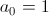
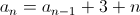

# ChelaJS

En el [ChelaJS][1] de Noviembre platicamos de la competencia de trucos sucios
y malas prácticas de Javascript [js1k][2]. El objetivo de ésta competencia es
hacer algo impresionante en 1024 bytes o menos de puro Javascript valiéndote
de cualquier trampa que conozcas. ¡Buena suerte comprimiendo jQuery!

Este repositorio contiene el código fuente de los ejercicios que vimos, varios
de éstos trucos los usé en mi [participación en js1k][4].

## Problema

El objetivo de éste ejemplo es crear un programa que imprima diez líneas,
cada una de las líneas con un asterisco (`*`) más que el anterior. La primer
línea comienza con un asterisco.

```
*
**
***
****
*****
******
*******
********
*********
```

## Código inicial

Comenzamos con [demo-00.js](./demo-00.js), el programa inicial usa dos
ciclos anidados, el ciclo de primel nivel cuenta las líneas, el ciclo
anidado imprime los asteriscos necesarios.

```javascript
var i;
var j;
for (i = 1; i < 10; i++) {
  for (j = 0; j < i; j++) {
    process.stdout.write('*');
  };
  process.stdout.write('\n');
};
```

Para correr el ejemplo anterior usamos el comando [node][2].

```
node demo-00.js
```

Revisemos el tamaño de éste programa sin contar espacios ni retornos de carro:

```
jsmin demo-00.js | wc -c
105
```

Podemos ver este programa como una sucesión de líneas, pero también podría
verse como una sola secuencia de bytes, con la particularidad de que el byte
`\n` se interpreta como una línea nueva.

```
# Impresión de una secuencia de bytes que equivale a 4 líneas.
echo "*\n**\n***\n****\n"
```

Por lo que podríamos reducir el problema a la impresión de una sóla línea
compuesta por los bytes `*` ó `\n`, los `\n` en el lugar correcto darán el
efecto de una nueva línea.

Usando [demo-01.js](./demo-01.js) encontramos la posición exacta de los `\n`
que buscamos:

```
*
--> 1
**
--> 4
***
--> 8
****
--> 13
*****
--> 19
******
--> 26
*******
--> 34
********
--> 43
*********
--> 53
```

Tenemos bytes `\n` en los lugares 1, 4, 8, 13, ..., 53 en una línea en donde
los bytes que no caen en los lugares mencionados son asteriscos.

Si fueramos Programadores Java Certificados, tal vez podríamos proponer una
solución como la de [demo-02.js](./demo-02.js) o [demo-lol.js](./demo-lol.js).

```javascript
// No hagamos ésto.
var i;
for (i = 0; i < 54; i++) {
  if (i == 1 || i == 4 || i == 8 || i == 13 || i == 19 || i == 26 || i == 34 || i == 43 || i == 53) {
    process.stdout.write('\n');
  } else {
    process.stdout.write('*');
  }
};
```

Afortunadamente nuestro Java Fu Corporativo es bajo y tenemos que limitarnos a
soluciones más rústicas, como lapiz y papel, para encontrar que los números de
posiciones en realidad son una secuencia que puede ser determinada por una
función:

Comenzando con *1* sumamos 3, el resultado es *4*; a éste 4 le sumamos 3 + 1,
nos resulta *8*; si a éste 8 agregamos 3 + 2, el resultado es *13*.

```
1   + 3 + 0 = 4
4   + 3 + 1 = 8
8   + 3 + 2 = 13
13  + 3 + 3 = 19
...
```

Intuitivamente la secuencia está dada por:





Con lo que podemos ahorrar el `for` anidado y llegar a un programa como
[demo-03.js](./demo-03.js).

```javascript
var i;
var j = 1;
var k = 0;
for (i = 0; i < 54; i++) {
  // Ya tenemos el patrón.
  if (i == j) {
    process.stdout.write('\n');
    j = j + 3 + k++;
  } else {
    process.stdout.write('*');
  }
};
```

## Proceso de compresión

Vamos a reducir de tamaño este programa sin que pierda la funcionalidad inicial.

```javascript
// Mindfuck.
var i;
var j = 1;
var k = 0;
for (i = 0; i < 54; i++) {
  process.stdout.write(((i == j) && (j += 3 + k++)) ? '\n' : '*');
};
```

Reescribimos [demo-03.js](./demo-03.js) en un sólo `process.stdout.write`
y arruinamos la poca legibilidad que quedaba. Repasemos
[demo-04.js](./demo-04.js) y veamos las particularidades:

* La condicional `if ... else ...` fue reemplazada por
un operador `... ? ... : ... `
* La línea `j = j + 3 + k++` se reemplazó por `j += 3 + k++` y se ejecuta
únicamente si `i == j`.
* La condicional va dentro de `process.stdout.write`.

Implementemos peores prácticas y no usemos `var` para declarar nuestras
variables, también quitemos algunos paréntesis, el intérprete de
Javascript perdonará nuestros olvidos sin quejarse y continuará la ejecución.

```javascript
j = 1;
for (k = i = 0; i < 54; i++) {
  process.stdout.write(i == j && (j += 3 + k++) ? '\n' : '*');
};
```

Podemos continuar llenando espacios, por ejemplo ¿qué tal mover el contenido
del `for` dentro de su parte condicional?

Veamos [demo-06.js](./demo-06.js).

```javascript
j = 1;
for (k = i = 0; i < 54 && process.stdout.write(i == j && (j += 3 + k++) ? '\n' : '*'); i++);
```

Podemos salvar un byte más si movemos el `i++` al contenido del `for`, como en
[demo-07.js](./demo-07.js)

```javascript
j = 1;
for (k = i = 0; i < 54 && process.stdout.write(i == j && (j += 3 + k++) ? '\n' : '*');)i++
```

Recordemos que cada byte cuenta, podríamos intentar salvar más bytes usando `while` para
nuestro ciclo en vez de `for`, como en [demo-08.js](./demo-08.js).

```javascript
k = i = 0, j = 1;
// Que tal usando while?
while (i < 54) process.stdout.write(i == j && (j += 3 + k++) ? '\n' : '*', i++)
```

Pero el resultado es equivalente, llevamos hasta ahora 72 bytes. Recordemos que
hay muchas formas de ensuciar un `for`, presionemos un poco más:

```javascript
// Creo que regresamos al for...
for (k = i = 0, j = 1; i < 54;) process.stdout.write(i == j && (j += 3 + k++) ? '\n' : '*', i++)
```

Con éste cambio llegamos a 71 bytes.

Intentamos reacomodar cosas en [demo-10.js](./demo-10.js), pero nos tomó un byte más...

```javascript
for (k = i = 0, j = 1; i < 54; process.stdout.write(i == j && (j += 3 + k++) ? '\n' : '*', i++));
```

Movamos un poco más, regresemos la impresión al contenido del `for` para
concluir con un [demo-11.js](./demo-11.js) de 70 bytes.

```javascript
for(k=i=0,j=1;i<54;i++)process.stdout.write(i==j&&(j+=3+k++)?'\n':'*')
```

## Conclusiones

Pasamos de 105 bytes a 70 bytes pero nos costó la legibilidad del programa,
esta secuencia de órdenes ya no es mantenible, puedes pasar horas intentando
descifrar qué es lo que hace. Ahora estamos listos para trabajar en algún
Corporativo Promedio.

```
cat | node
for(k=i=0,j=1;i<54;i++)process.stdout.write(i==j&&(j+=3+k++)?'\n':'*')
*
**
***
****
*****
******
*******
********
*********
```

Para escribir Javascript más sano, recomiendo consultar
[Code Conventions for the JavaScript Programming Language][5].

[1]: https://twitter.com/Chela_js
[2]: http://www.js1k.com
[3]: http://www.nodejs.org
[4]: http://js1k.com/2013-spring/demo/1462
[5]: http://javascript.crockford.com/code.html
